# US Personal Finance Flowchart Reference

This document serves as the standard operational guide and decision tree for personal finance management in the United States. Use this roadmap to analyze the user's current situation and recommend their next financial priority.

## Flowchart Logic Diagram

```mermaid
graph TD
    classDef phase0 fill:#f3f4f6,stroke:#1f2937,stroke-width:2px;
    classDef step1 fill:#fee2e2,stroke:#ef4444,stroke-width:2px;
    classDef step2 fill:#ffedd5,stroke:#f97316,stroke-width:2px;
    classDef step3 fill:#dcfce7,stroke:#22c55e,stroke-width:2px;
    classDef step4 fill:#e0f2fe,stroke:#0ea5e9,stroke-width:2px;
    classDef step5 fill:#dbeafe,stroke:#3b82f6,stroke-width:2px;
    classDef step6 fill:#f3e8ff,stroke:#a855f7,stroke-width:2px;

    Start[Create Budget]:::phase0
    Start --> PayRent[Pay Rent/Mortgage]:::phase0
    PayRent --> PayFood[Buy Food/Groceries]:::phase0
    PayFood --> PayEssentials[Pay Essential Items: Utilities, power, water, heat]:::phase0
    PayEssentials --> PayIncomeExpenses[Pay Income Earning Expenses: Work transport, basic phone]:::phase0
    PayIncomeExpenses --> PayHealth[Pay Health Care: Insurance and urgent care]:::phase0
    PayHealth --> PayMinDebt[Make Minimum Payments on All Debts & Loans]:::phase0
    PayMinDebt --> PayNonEssentials[Pay Any Non-Essential Bills in Full]:::phase0

    PayNonEssentials --> BuildSmallEF[Build Small Emergency Fund: $1000 or 1 month of expenses]:::step1
    BuildSmallEF --> MatchCheck{Does your employer offer a retirement match?}:::step2

    MatchCheck -- Yes --> GetMatch[Contribute up to employer match limit, nothing more]:::step2
    MatchCheck -- No --> HighDebtCheck{Do you have high-interest debt >= 10%?}:::step3
    GetMatch --> HighDebtCheck

    HighDebtCheck -- Yes --> PayHighDebt[Pay off high-interest debt using Avalanche or Snowball]:::step3
    HighDebtCheck -- No --> BuildFullEF[Increase Emergency Fund to 3-6 months expenses]:::step1
    PayHighDebt --> BuildFullEF

    BuildFullEF --> ModDebtCheck{Do you have moderate-interest debt 4-5% excluding mortgage?}:::step3
    ModDebtCheck -- Yes --> PayModDebt[Pay off moderate-interest debt using Avalanche or Snowball]:::step3
    ModDebtCheck -- No --> InvestIRA[Evaluate Roth vs. Traditional IRA and max out contributions]:::step4
    PayModDebt --> InvestIRA

    InvestIRA --> LargePurchaseCheck{Expecting large required purchases soon? e.g. car, college}:::step4
    LargePurchaseCheck -- Yes --> SavePurchase[Save needed amount in standard savings/checking]:::step4
    LargePurchaseCheck -- No --> PreTax15Check{Currently saving >= 15% pre-tax for retirement?}:::step5
    SavePurchase --> PreTax15Check

    PreTax15Check -- Yes --> HSACheck{Eligible for investable HSA via HDHP?}:::step6
    PreTax15Check -- No --> Employer401kCheck{Employer offers 401k, 403b, or similar?}:::step5

    Employer401kCheck -- Yes --> Increase401k[Increase contributions to reach 15% pre-tax savings]:::step5
    Employer401kCheck -- No --> SelfEmployedCheck{Are you self-employed?}:::step5

    SelfEmployedCheck -- Yes --> InvestSelfEmployed[Contribute to Solo 401k, SEP-IRA, or SIMPLE IRA to hit 15%]:::step5
    SelfEmployedCheck -- No --> InvestTaxable[Contribute to taxable account to hit 15%]:::step5

    Increase401k --> HSACheck
    InvestSelfEmployed --> HSACheck
    InvestTaxable --> HSACheck

    HSACheck -- Yes --> MaxHSA[Max out yearly HSA contributions]:::step6
    HSACheck -- No --> CollegeSavingsCheck{Have children and wish to save for college?}:::step6
    MaxHSA --> CollegeSavingsCheck

    CollegeSavingsCheck -- Yes --> Invest529[Invest in 529 plan or college savings vehicle]:::step6
    CollegeSavingsCheck -- No --> FinalPhase[Evaluate advanced options based on goals]:::step6
    Invest529 --> FinalPhase

    FinalPhase --> RetireEarlyCheck{Would you like to retire early?}:::step6
    RetireEarlyCheck -- Yes --> MaxRetirement[Max out pre-tax accounts, consider Backdoor/Mega Backdoor Roth]:::step6
    RetireEarlyCheck -- No --> ImmediateGoalsCheck{Do you have more immediate goals?}:::step6

    ImmediateGoalsCheck -- Yes --> SaveImmediate[Save in conservative mix or savings for < 3-5 year goals]:::step6
```

---

## Detailed Roadmap Phases

### Phase 0: Budget & Reduce Expenses (Setup & Survival)
1. **Create a Budget:** Track all sources of income and all expenses.
2. **Prioritize Basics (Survival):**
   * Pay Rent/Mortgage (including renters or home insurance).
   * Buy Food/Groceries.
   * Pay Essential Utilities (power, water, heat).
   * Pay Income-Earning Expenses (transportation to work, work phone).
   * Pay Health Care (insurance premiums and critical medical expenses).
3. **Handle Obligations:** Make minimum payments on all active debts and loans (student loans, credit cards, auto loans) to protect credit score and avoid defaults.
4. **Discretionary Spending:** Pay non-essential bills in full (cable, subscriptions) or reduce them to maximize savings.

### Step 1: Emergency Fund (Phase A)
* **Action:** Build a starter emergency fund of **$1,000** or **1 month of expenses**, whichever is greater. Keep these funds liquid in a savings or checking account.

### Step 2: Employer Matching
* **Action:** If the employer offers a retirement account (e.g., 401k) with a match, contribute exactly the amount needed to maximize that match. Do not contribute above the match limit at this stage.

### Step 3: Debt Paydown
* **High-Interest Debt:** Pay off all debt with an interest rate of **10% or higher** (e.g., credit cards) using either the **Avalanche Method** (highest interest first) or **Snowball Method** (smallest balance first).
* **Moderate-Interest Debt:** Once the emergency fund is fully built, pay off debt with an interest rate between **4-5%** (excluding primary mortgage).

### Step 1: Emergency Fund (Phase B - Full Coverage)
* **Action:** Increase the liquid emergency savings to cover **3 to 6 months of living expenses**.

### Step 4: Retirement (IRA) & Higher Education
* **Retirement (IRA):** Maximize yearly contributions to an Individual Retirement Account (Roth or Traditional depending on tax bracket).
* **Large Purchases:** If expecting large necessary purchases (car for work, certification, college) in the near future, save the cash in a liquid account.

### Step 5: High-Volume Retirement Saving
* **Action:** Increase total retirement savings to **15% of pre-tax income**.
* **Vehicle:** Utilize employer-sponsored plans (401k/403b) or self-employed vehicles (Solo 401k, SEP-IRA, SIMPLE IRA). If unavailable, use a taxable brokerage account.

### Step 6: Advanced Optimization & Long-Term Goals
1. **Health Savings Account (HSA):** If enrolled in a High-Deductible Health Plan (HDHP), max out yearly HSA contributions and invest the funds for long-term growth.
2. **College Savings:** If saving for children's education, contribute to a **529 plan**.
3. **Advanced Goals:**
   * **Retire Early:** Max out pre-tax accounts, leverage backdoor/mega-backdoor Roth conversion strategies, and invest in taxable brokerage accounts.
   * **Immediate Goals (< 5 years):** Keep savings in cash, CDs, or a conservative short-term bond/stock mix (e.g., house down payment, vacation fund).
